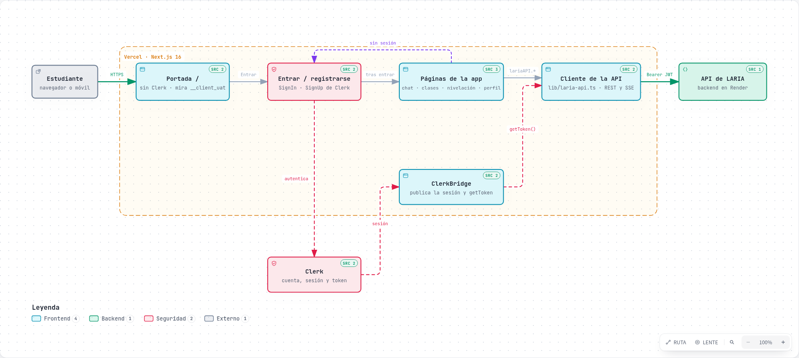
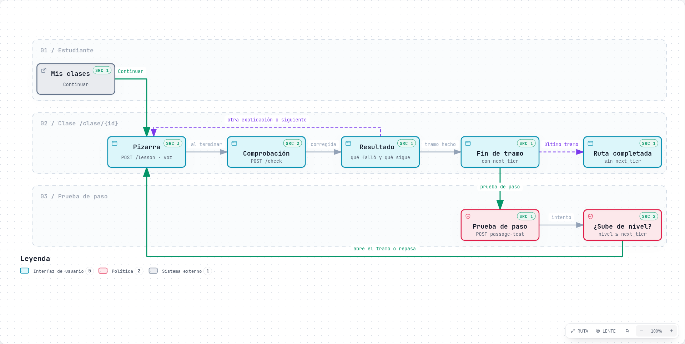
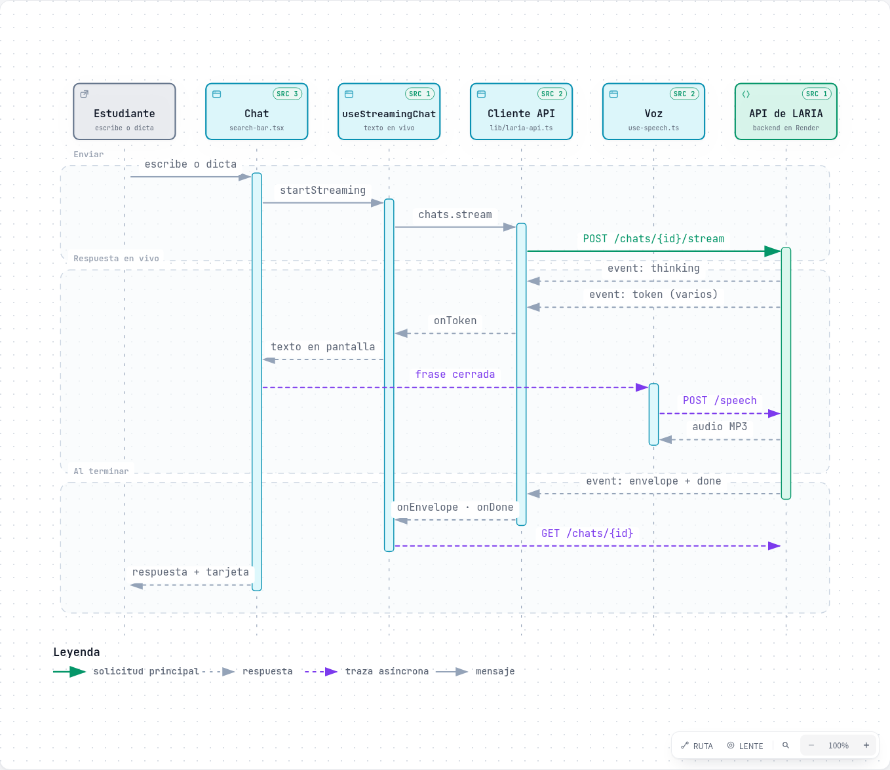

# Plenum · LARIA-UI

El frontend de **Plenum**, una plataforma para estudiar con **LARIA**, un tutor con IA que
se adapta a cómo aprende cada estudiante. Este repositorio es la web (Next.js). El backend
(FastAPI, en Render) está en el repositorio LARIA-IA.

- Producción: https://laria-frontend.vercel.app
- API: https://laria-ia.onrender.com/api/v1

## Qué hace

**Aprender con tu material.** El estudiante sube apuntes, libros, diapositivas u hojas
de cálculo al chat, y LARIA los analiza en segundo plano para explicarle a partir de
ellos y hacerle cuestionarios sobre ellos. Acepta PDF, Word, PowerPoint, Excel, texto y
código, hasta 25 MB.

**Aprender sin material.** El estudiante dice «quiero aprender X» y LARIA le hace una
**nivelación** por rondas (básico, intermedio o avanzado). Después le pregunta cómo
prefiere que le expliquen y cuánto quiere estudiar, y abre una **clase guiada**.

**Clases guiadas** (`/clase/{id}`).
- Una ruta de módulos por **tramos**: básico → intermedio → avanzado.
- Cada concepto se explica en una **pizarra**, con fórmulas (KaTeX), y termina con una
  comprobación corta.
- Si la comprobación no sale bien, LARIA lo explica de otra manera o repasa lo previo.
- Al terminar un tramo, la **prueba de paso** (`/clase/{id}/prueba-de-paso`) abre el
  siguiente en la misma ruta.
- Los tramos intermedio y avanzado traen **fuentes** e **ideas clave**.
- Al completar la ruta, LARIA sugiere cómo seguir.

**LARIA, la mascota.** Es el astronauta del logo, animado con sus trazos originales. Parpadea,
piensa, habla moviendo la boca al ritmo de la voz, señala la pizarra en los datos
importantes y reacciona a los resultados (celebra, anima, tiene paciencia).

**Voz.**
- **Leer en voz:** LARIA lee sus respuestas frase a frase mientras escribe, y la pizarra
  muestra cada frase al decirla. Hay 6 voces para elegir en el perfil.
- **Dictado:** con el micrófono, en los navegadores que lo permiten (Chrome, Edge y
  Safari). En el móvil, una frase por pulsación.

**Estudio y progreso.**
- **Mis clases** (`/clases`): en curso, pendientes de nivelación o prueba de paso, y
  completadas.
- **Metas:** duración de cada clase y objetivo diario, con cronómetro, racha y anillo de
  progreso.
- **Perfil** (`/perfil`): dominio por concepto, nivel por tema, estilo de explicación,
  voz y metas.
- **Quizzes** (`/quiz`) sobre los documentos de un chat.

**Cuenta.**
- Entrar y registrarse con **Clerk** (correo con código, Google o Microsoft).
- Tutorial de bienvenida la primera vez.
- Gestionar la cuenta y **borrarla**, con verificación de identidad (`/cuenta`).

**Cuidado del estudiante.**
- Los temas que no se trabajan (armas, drogas, odio…) se explican sin tratarlos como un
  error.
- Ante señales de autolesión, LARIA responde con un mensaje de apoyo sobrio.

## Tecnología

| Qué | Con qué |
|---|---|
| Framework | Next.js 16 (App Router, Turbopack), React 19, TypeScript |
| Estilos | Tailwind CSS v4, componentes shadcn/Radix, modo claro y oscuro (next-themes) |
| Cuenta | Clerk (`@clerk/nextjs`), en español |
| Contenido | react-markdown + remark-gfm; fórmulas con remark-math + rehype-katex (carga diferida) |
| Animación | CSS (mascota, pizarra); motion solo en la portada |
| Tests | Vitest + Testing Library (jsdom) |
| Despliegue | Vercel |

## Cómo está organizado

```
app/
  page.tsx                  Portada (sin Clerk: carga ligera)
  sign-in, sign-up          Entrar y registrarse (pantallas de Clerk)
  (chat)/chat/[id]          El chat con LARIA
  clase/[pathId]            Clase guiada (pizarra, comprobación, tramos)
    prueba-de-paso          Prueba de paso al siguiente tramo
  clases/                   Mis clases
  nivelacion/               Nivelación en un tema
  quiz/                     Quizzes sobre documentos
  perfil/                   Progreso, estilo, voz y metas
  cuenta/                   Cuenta de Clerk y borrar la cuenta
  components/               Componentes compartidos (chat, mascota, voz, tutorial…)
  contexts/                 Sesión (AuthProvider) y chats (ChatProvider)
hooks/                      Voz, dictado, streaming del chat, tiempo de estudio…
lib/
  laria-api.ts              Cliente de la API (token de Clerk, errores en español, SSE)
  routes.ts                 Rutas de la app, en un solo sitio
test/                       Utilidades de los tests (SSE, voz y dictado simulados)
proxy.ts                    Middleware de Clerk (no se aplica a la portada)
```

Algunas decisiones que conviene conocer:

- **La sesión.** Clerk emite el token. `ClerkBridge` lo registra en `lib/laria-api.ts` y
  cada petición pide uno nuevo con `getToken()`. Ante un 401 se reintenta una vez con un
  token nuevo y, si vuelve a fallar, se cierra la sesión.
- **La portada no carga Clerk.** `AppProviders` solo carga la sesión fuera de `/`. Para
  saber si hay sesión, la portada lee la cookie `__client_uat`.
- **Sin claves de Clerk, la app no se cae.** Se ve sin sesión y las pantallas de entrar lo
  explican (`lib/clerk-config.ts`).
- **Compatibilidad con el backend.** Si el backend aún no tiene un endpoint nuevo (404),
  esa parte no se muestra. Así se puede desplegar el frontend antes que el backend.

## Diagramas

Generados con [archify](https://github.com/tt-a1i/archify) a partir del código. Cada nodo
enlaza a las líneas que lo respaldan. Las imágenes son capturas; la versión interactiva
(zoom, modo oscuro, índice de nodos y enlaces al código) es el HTML de cada diagrama, en
[`docs/diagramas/`](docs/diagramas/): ábrelo en el navegador.

### Arquitectura del cliente

Quién habla con quién: la portada sin Clerk, las pantallas de Clerk, las páginas de la app,
el cliente de la API con el token de Clerk y el backend en Render.



[Versión interactiva](docs/diagramas/arquitectura-cliente.html) ·
[fuente](docs/diagramas/arquitectura-cliente.json)

### Una clase guiada por tramos

De «Mis clases» a la pizarra y la comprobación. Según el resultado, otra explicación o el
siguiente concepto; al terminar un tramo, la prueba de paso abre el siguiente en la misma
ruta.



[Versión interactiva](docs/diagramas/clase-por-tramos.html) ·
[fuente](docs/diagramas/clase-por-tramos.json)

### Un turno del chat

El mensaje viaja por SSE: el texto aparece mientras llega, la voz lee cada frase cerrada y,
al terminar, el envelope decide qué ofrecer (nivelación, quiz o estilo).



[Versión interactiva](docs/diagramas/turno-del-chat.html) ·
[fuente](docs/diagramas/turno-del-chat.json)

### Regenerar los diagramas

La fuente de cada diagrama es su `.json`. Lleva el commit al que apuntan sus referencias
al código (`meta.repository.revision`): si cambia el código que describe, actualiza el
JSON (y ese commit) y vuelve a generar:

```bash
A=~/.claude/skills/archify/bin/archify.mjs   # donde esté instalado archify
node $A finalize architecture docs/diagramas/arquitectura-cliente.json docs/diagramas/arquitectura-cliente.html --repo-root . --quality showcase --json
node $A finalize workflow     docs/diagramas/clase-por-tramos.json     docs/diagramas/clase-por-tramos.html     --repo-root . --quality showcase --json
node $A finalize sequence     docs/diagramas/turno-del-chat.json       docs/diagramas/turno-del-chat.html       --repo-root . --quality showcase --json
```

- **Comprobación en el navegador:** `finalize` la hace con Chrome. Si Chromium no arranca con
  sandbox (pasa en Ubuntu con AppArmor), apunta `ARCHIFY_CHROME` a un envoltorio que añada
  `--no-sandbox`.
- **Capturas para el README:** con `visual-check --out-dir <carpeta>`; después se recorta el
  panel del diagrama a PNG.
- **Recibos:** los `*.delivery.json`, `*.finalize*.json` y `*.browser-check.json` llevan rutas
  locales y están en `.gitignore`.

## Desarrollo

Requiere **Node 20+** (Vercel y la CI usan 24) y **pnpm 10+**. pnpm 9 no entiende
`pnpm-workspace.yaml`; si es el que tienes instalado, usa `npx -y pnpm@10`.

```bash
pnpm install          # también activa los hooks de git
pnpm dev -p 4321      # http://localhost:4321
```

Usa el puerto **4321**: es el origen que el backend permite por CORS en desarrollo.

### Variables de entorno (`.env.local`, no se sube al repositorio)

| Variable | Para qué |
|---|---|
| `NEXT_PUBLIC_LARIA_API_URL` | URL de la API. Por defecto `http://localhost:8000/api/v1`; para usar la de producción: `https://laria-ia.onrender.com/api/v1` |
| `NEXT_PUBLIC_CLERK_PUBLISHABLE_KEY` | Clave pública de Clerk (`pk_…`) |
| `CLERK_SECRET_KEY` | Clave secreta de Clerk (`sk_…`). **Nunca** en el código ni en el chat |
| `NEXT_PUBLIC_CLERK_SIGN_IN_URL` / `…_SIGN_UP_URL` | `/sign-in` y `/sign-up` |

En Vercel hacen falta las mismas variables en el entorno **Production** (y Preview).
Después de cambiarlas hay que hacer **Redeploy**, porque las `NEXT_PUBLIC_…` se incluyen
al compilar.

## Tests y comprobaciones

```bash
pnpm test        # Vitest
pnpm lint
pnpm typecheck
pnpm verify      # lint + tipos + tests + build de producción
```

- **Antes de cada push**, un hook (`.husky/pre-push`) ejecuta `verify` y cancela el push
  si algo falla. Solo en una emergencia: `git push --no-verify`.
- **En GitHub**, la CI (`.github/workflows/ci.yml`) repite las mismas comprobaciones en
  cada PR y en `main`. La protección de `main` exige que pasen para poder fusionar.
- Si `tsc` da errores raros tras cambiar de rama, borra los tipos generados:
  `rm -rf .next/types`.

Los tests simulan la API con `fetch` y, cuando hace falta, Clerk, la voz (`HTMLMediaElement`,
Web Audio) y el dictado (`test/speech.ts`). Cada funcionalidad nueva lleva sus tests.

## Cómo se trabaja

- Una rama y una PR por cambio, **siempre desde `main`**, para no arrastrar cambios de otras
  PR sin fusionar.
- Los mensajes de commit y de PR van en español y explican el porqué.
- El código y los comentarios siguen el estilo que ya hay: nombres claros y comentarios
  que explican decisiones, no lo obvio.
- Los cambios de contrato con el backend se acuerdan antes, y su documentación está en
  el repositorio del backend (`backend/docs/`).

## Despliegue

Vercel construye y despliega `main` automáticamente. Cada PR tiene su vista previa, y el
backend acepta las de este proyecto por CORS. Que se pueda iniciar sesión en una vista
previa depende de los dominios permitidos en el panel de Clerk.
